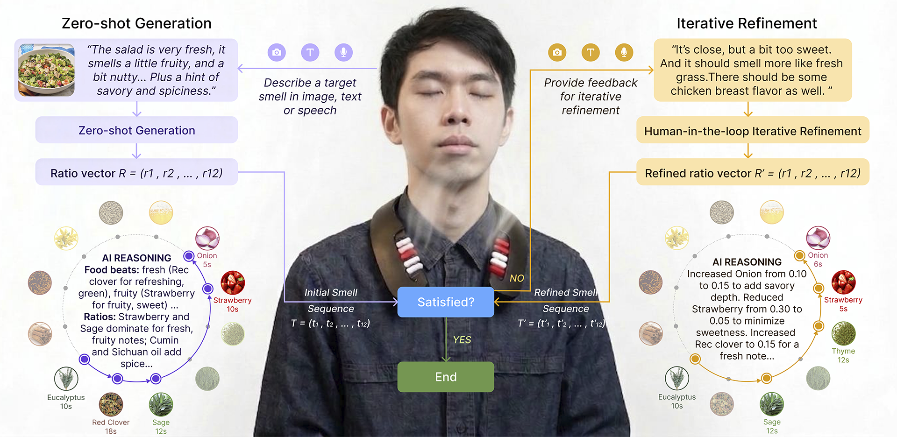

# AromaGen: Interactive Generation of Rich Olfactory Experiences with Multimodal Language Models

**Yunge Wen**\*¹, **Awu Chen**\*¹, **Jianing Yu**\*², **Jas Brooks**³, **Hiroshi Ishii**¹, **Paul Pu Liang**¹  
\*Equal contribution  
¹MIT Media Lab &nbsp;·&nbsp; ²Harvard Graduate School of Design &nbsp;·&nbsp; ³MIT CSAIL

## Abstract

Smell's deep connection with food, memory, and social experience has long motivated researchers to bring olfaction into interactive systems. Yet most olfactory interfaces remain limited to fixed scent cartridges and pre-defined generation patterns, and the scarcity of large-scale olfactory datasets has further constrained AI-based approaches. We present AromaGen, an AI-powered wearable interface capable of real-time, general-purpose aroma generation from free-form text or visual inputs. AromaGen is powered by a multimodal LLM that leverages latent olfactory knowledge to map semantic inputs to structured mixtures of 12 carefully selected base odorants, released through a neck-worn dispenser. Users can iteratively refine generated aromas through natural language feedback via in-context learning. Through a controlled user study (N=26), AromaGen matches human-composed mixtures in zero-shot generation and significantly surpasses them after iterative refinement, achieving a median similarity of 8/10 to real food aromas and reducing perceived artificiality to levels comparable to real food. AromaGen is a step towards real-world interactive aroma generation, opening new possibilities for communication, wellbeing, and immersive technologies.




## Installation

```bash
pip install -r requirements.txt
```

## Usage

```bash
# Start the backend
uvicorn main:app --reload
```

Then open `index.html` in your browser.


## Citation

```bibtex
@article{wen2025aromagen,
  title={AromaGen: Interactive Generation of Rich Olfactory Experiences with Multimodal Language Models},
  author={Wen, Yunge and Chen, Awu and Yu, Jianing and Brooks, Jas and Ishii, Hiroshi and Liang, Paul Pu},
  year={2026}
}
```

## License

MIT License